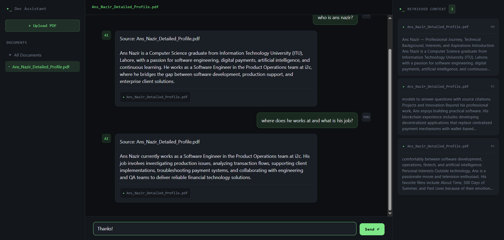

# 📚 AI Documentation Assistant with Retrieval, Reranking & Groq LLM

> An advanced Retrieval-Augmented Generation (RAG) application that enables users to upload PDF documents and ask natural language questions. The system combines semantic retrieval, cross-encoder reranking, and Groq LLM to deliver accurate, context-aware responses.

🌐 **Live Demo:** https://docassistant-frontend.onrender.com/



---

## 🚀 Features

- Upload and process PDF documents
- Semantic search using vector embeddings
- Cross-encoder reranking for improved retrieval accuracy
- AI-powered question answering with Groq LLM
- Conversation history stored in PostgreSQL
- FastAPI REST API
- React + Vite frontend
- Docker support
- Deployed on Render

---

## 🏗️ Architecture

```text
                PDF Upload
                     │
                     ▼
              Text Extraction
                     │
                     ▼
             Document Chunking
                     │
                     ▼
          Generate Embeddings
                     │
                     ▼
                ChromaDB
                     │
             Initial Retrieval
                     │
                     ▼
          Cross-Encoder Reranking
                     │
                     ▼
      Top Ranked Context + User Query
                     │
                     ▼
                  Groq LLM
                     │
                     ▼
                AI Response
```

---

## ⚙️ Tech Stack

| Category         | Technologies                         |
| ---------------- | ------------------------------------ |
| Backend          | FastAPI, Python                      |
| Frontend         | React, Vite                          |
| Vector Database  | ChromaDB                             |
| Embeddings       | FastEmbed                            |
| Reranking        | CrossEncoder (Sentence Transformers) |
| LLM              | Groq                                 |
| Database         | PostgreSQL                           |
| PDF Processing   | PyPDF                                |
| Deployment       | Render                               |
| Containerization | Docker                               |


---

## 📂 Project Structure

```
AI-Doc-Rag/
│
├── backend/
│   ├── api/
│   ├── services/
│   ├── models/
│   ├── database/
│   └── main.py
│
├── frontend/
│
├── docker-compose.yml
└── README.md
```

---

## 🔄 Workflow

1. Upload a PDF document.
2. Extract text from the document.
3. Split the text into manageable chunks.
4. Generate embeddings using FastEmbed.
5. Store embeddings in ChromaDB.
6. User submits a question.
7. Retrieve the most relevant document chunks using semantic similarity.
8. Rerank the retrieved chunks with a Cross-Encoder model to improve relevance.
9. Send the top-ranked context and user query to the Groq LLM.
10. Generate and return the final answer.

---

## 📦 Libraries Used

| Library | Purpose |
|----------|---------|
| FastAPI | REST API framework |
| ChromaDB | Vector database |
| FastEmbed | Embedding generation |
| sentence-transformers | Cross-Encoder reranking of retrieved chunks |
| Groq | Large Language Model inference |
| PyPDF | PDF text extraction |
| SQLAlchemy | Database ORM |
| psycopg2 | PostgreSQL driver |
| LangChain Text Splitters | Document chunking |
| tiktoken | Token counting |
| python-dotenv | Environment variable management |


---

## 🚀 Running Locally

```bash
git clone https://github.com/ansdaultana/AI-Doc-Rag.git

cd AI-Doc-Rag

docker-compose up --build
```

Or run the frontend and backend separately.

---

## 🌐 Deployment

The application is deployed on **Render**.

**Live Demo**

https://docassistant-frontend.onrender.com/

---

## 🔮 Future Improvements

- Support multiple document uploads
- Hybrid keyword + semantic search
- Authentication and user accounts
- Streaming LLM responses
- OCR support for scanned PDFs
- Document management dashboard

---

## 👨‍💻 Author

**Ans Nazir**

Computer Science Graduate | Software Engineer

GitHub:   https://github.com/ansdaultana

LinkedIn: https://www.linkedin.com/in/ans-nazir/